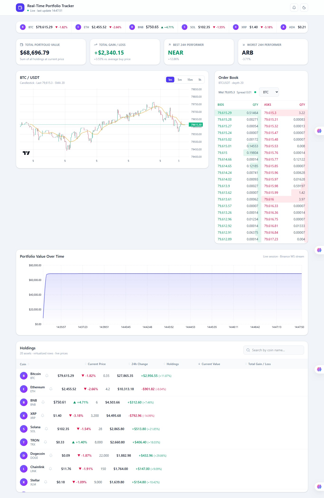

# Real-Time Portfolio Tracker

A cryptocurrency portfolio dashboard that streams live Binance prices over WebSockets — virtualized holdings table, order book, candlestick charts, and one-shot price alerts, with zero polling.

## Preview

> Screenshot / GIF placeholder — add images manually.




**Live demo:** [Add Vercel link here]

## Features

- **Real-time WebSocket price streaming** — 20 high-liquidity USDT pairs over a single combined Binance stream, batched into one store update per 100 ms. Exponential-backoff auto-reconnect, stale-socket watchdog, manual retry, and live/reconnecting/error status UI.
- **Virtualized data table** — holdings table renders only visible rows (`@tanstack/react-virtual`) with search and multi-key sorting; every row is guaranteed live data.
- **Order book** — top-20 bids/asks per selected symbol with depth bars, mid price, and spread; skeleton loaders while streaming starts.
- **Candlestick charts with SMA** — 300-candle REST history + live kline stream, SMA-20 overlay, 1m/5m/15m/1h intervals (`lightweight-charts`).
- **Price alerts** — per-coin above/below thresholds with in-app toasts, optional browser Notifications, header management panel with badge, and bell indicators on alert rows. One-shot: fires once, then removes itself.
- **Animations** — Framer Motion price pulse on ticks, spring row-reorder on sort, fade/slide on coin switch, animated toasts/dialogs (respects `prefers-reduced-motion`).
- **Error boundaries with auto-reconnect** — table, chart, order book, ticker, summary, and portfolio chart are each independently wrapped; a crash in one renders a per-section fallback with retry instead of taking down the app.
- **Dark / light themes** — persisted, system-aware, with a no-flash init script.

## Tech Stack

| Layer | Choice |
| --- | --- |
| Framework | React 19 + TypeScript |
| Build | Vite 8 |
| Styling | Tailwind CSS v4 |
| State | Zustand 5 (market store + persisted alert store) |
| Charts | `lightweight-charts` 5 (candles), Recharts (portfolio area) |
| Virtualization | `@tanstack/react-virtual` |
| Animation | Framer Motion |
| Tests | Jest 30 + `@swc/jest` + Testing Library (jsdom) |
| Lint | oxlint |
| Data | Binance WebSocket API (`@ticker`, `@depth20`, `@kline`) + REST klines |

## Architecture Decisions

### Why WebSocket over polling?

The original design polled a REST endpoint every 15 s for every coin. Binance's `@ticker` stream pushes each symbol's price roughly every second over a single socket — ~15x fresher UI for less network traffic. The tradeoff is connection-state complexity (reconnects, staleness, message formats), which is isolated in `services/marketStream.ts` (combined ticker stream) and the reusable `hooks/useRawStream.ts` (depth, klines) so components stay declarative.

### Why virtualization?

Even at 20 rows the table technique matters, and the catalog once held 130 rows where naive rendering was impractical. `@tanstack/react-virtual` keeps only visible rows (+ overscan) in the DOM inside a fixed-height scroll body with stable `table-fixed` column widths. Row position is driven by Framer Motion (`animate={{ y }}` spring), which doubles as a smooth sort-reorder glide.

### Why Zustand over Context API?

Context re-renders every consumer on any state change — fatal at ~20 ticks/sec. Zustand lets each component subscribe to an exact slice (`state.prices[coin.id]` per row, whole map only where sorting needs it, `selectedCoinId` for chart panels), and `Object.is` comparison skips untouched subscribers. Alerts live in a separate store so toast/dialog churn never touches the market hot path.

### How re-renders are minimized during high-frequency updates

- **100 ms tick batching** — raw messages buffer into one `setState` per flush.
- **Referentially stable prices** — `applyTickerUpdate` returns the same object when a price didn't move, so `Object.is` bails out unchanged rows; a BTC tick re-renders only the BTC row + ticker item.
- **Memoization boundaries** — rows, ticker items, header, and panels are `memo`-ized with stable props; rows read prices from the store, never via props.
- **Root doesn't subscribe to prices** — metrics compute inside `SummaryCards`, the single consumer.
- **Imperative chart bridge** — `lightweight-charts` instances are created once in refs and fed via effects, preserving pan/zoom with zero React DOM work inside the canvas.
- **Scoped subscriptions** — single-consumer, high-churn data (order-book depth) stays in a local hook instead of the store.

## AI-Assisted Development

This project was built using **Cursor with AI-assisted workflows** — planned feature-by-feature (streaming → table → order book → candles → store → tests → alerts → motion → polish), with explicit performance reasoning at each step.

**AI-generated:** boilerplate and wiring (store slices, parsers, hooks, component shells, test scaffolding, README drafts), plus first passes at complex pieces like the WebSocket reconnect state machine and the virtualized table.

**Manually refined:** performance-critical sections (batching intervals, selector granularity, reference-stability in `applyTickerUpdate`), the 20-coin universe decision after discovering delisted pairs in the catalog, hand-calibrated mock buy prices, and all visual/UX details (contrast fixes, skeleton states, motion tuning).

**Review & verification:** every step had to keep `npm run build` (typecheck + bundle), `npm run lint` (oxlint, zero warnings), and `npm test` (68 tests) green before moving on; tests caught real bugs (a zustand selector returning a fresh array caused an infinite render loop; a `b`/`a` vs `bids`/`asks` depth-payload mismatch); performance-sensitive code was reviewed against live tick behavior, and the production build was serve-tested.

## Getting Started

```bash
npm install
npm run dev      # start the dev server (http://localhost:5173)
```

## Running Tests

```bash
npm test          # Jest: 68 tests across 13 suites (unit + hooks + components)
npm run test:watch
npm run lint      # oxlint — must report 0 warnings
npm run build     # tsc -b && vite build
```

Test coverage includes portfolio math, SMA, formatting, sort/filter, Binance message parsers, the market pipeline (batching, throttling, backoff, retry via a fake `WebSocket`), alert crossing/persistence/watcher, and key components. The virtual scroll container and canvas chart are intentionally not unit-tested (jsdom has no layout/canvas); the logic they depend on is covered through extracted pure functions.

## Lessons Learned / Performance Notes

- **Catalogs rot.** A 130-pair list silently accumulated delisted/migrated symbols (BUSD, MATIC→POL, AGIX/OCEAN→FET) whose rows could never receive data. Curating a verified 20-pair universe beat any amount of subscription-batching logic.
- **Mock data needs calibration, not randomness.** Hash-generated buy prices produced a −92% portfolio; calibrating against live prices (≈ +3.5% overall, mixed winners/losers) made the dashboard believable.
- **Selectors returning new identities are silent killers** — in both Zustand (`Object.is` bailouts) and React (`memo`, effect deps). Caught twice: price objects and a filtered-alerts selector.
- **Match the parser to the stream.** `@depth20` partial-book snapshots use `bids`/`asks`, not the diff-stream `b`/`a` — verified against the live socket, not the docs alone.
- **Lighthouse scores:** [to be filled in manually after deploy — run Performance / Accessibility / Best Practices / SEO and record here; if Performance < ~90, code-split `lightweight-charts` and Recharts behind `React.lazy`.]

## Project Layout

```
src/
  components/   layout/ · summary/ · table/ · ticker/ · orderbook/ · chart/ · alerts/ · common/
  data/         coin catalog + 20-coin portfolio set + calibrated holdings
  hooks/        useRawStream · useOrderBook · useCandles · usePriceFlash · useTheme · useAlertWatcher
  services/     binance.ts (parsers/builders) · marketStream.ts (WS controller)
  store/        marketStore.ts · alertStore.ts (persisted alerts, session toasts/dialog)
  utils/        format · portfolio · indicators · holdingsSort · alerts · notify
  types/        domain + Binance wire types
```
